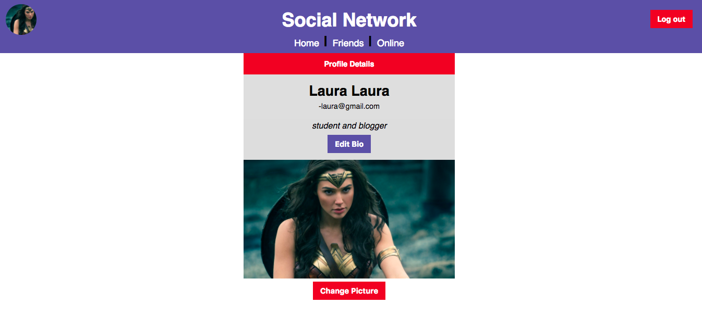
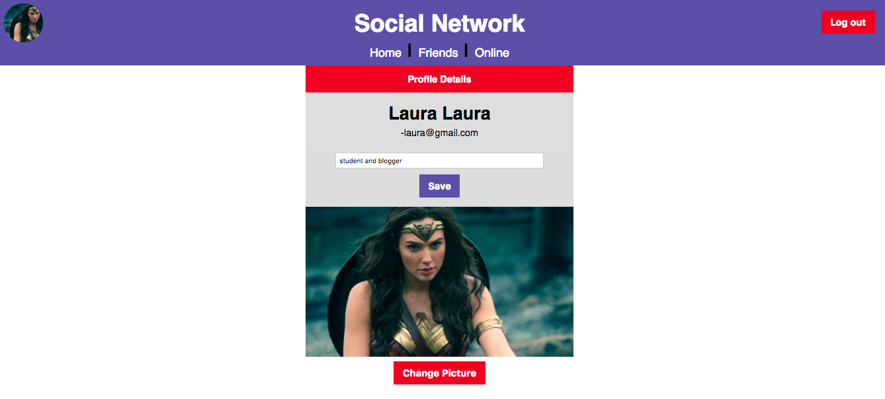
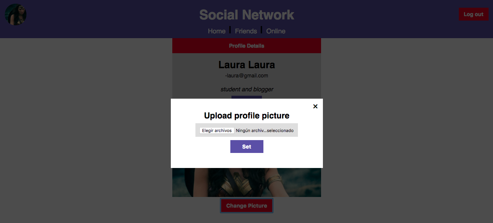
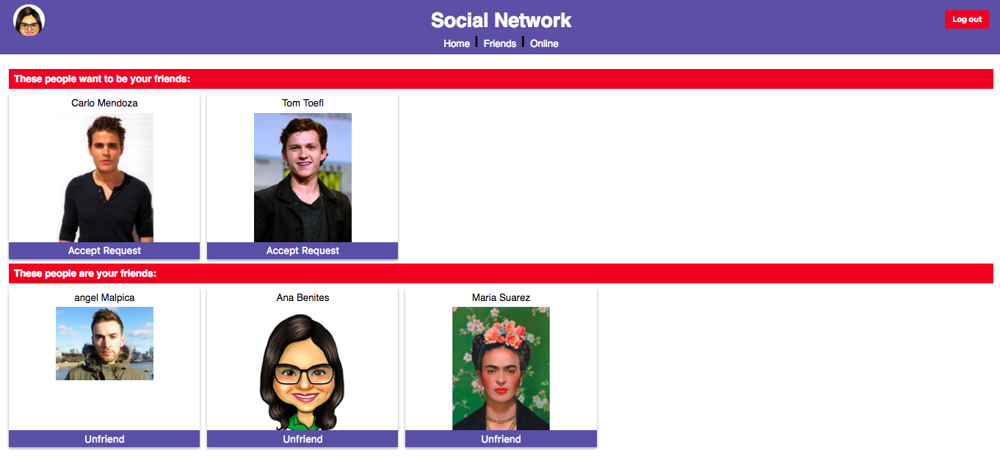
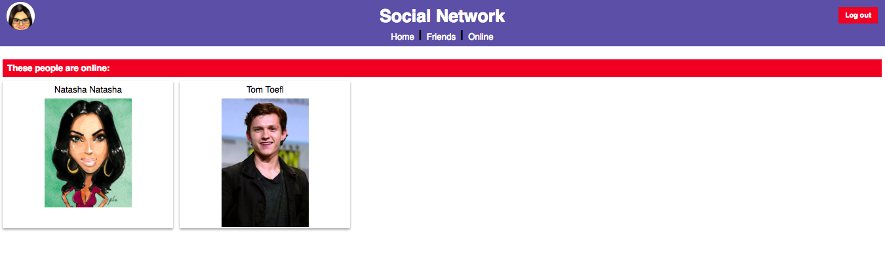

# Social Network Project:

A social network project on which users can sign up, say a little about themselves, and become friends with other users.
A single-page application made with React.

Webpack, the tool we use to compile our code, will start with src/start.js. Any js file that start.js imports from (as well as the files that those files import from) will be included in the bundle.

## Features:

1. Login, registration and log out button.

2. Profile of the logged in user.

3. Edit option in the user's profile.

4. Upload image option in the user's profile.

5. Options to: send friend request invitation, cancel it, accept it and unfriend it.

6. See through socket.io who's user is online.

## Using this repo in development

The `src` directory is where all of your client-side Javascript code should live. The file `src/start.js` is the entry point for your React application. All other files you use will either be imported by `start.js` or imported by files that are imported `start.js` (or imported by files that are imported by files that are imported by `start.js`, etc.).

To run your app in development, you need to start two servers.

1. `bundle-server.js` - this server will listen on port 8081 and does nothing but compile the code in `src/start.js` and its dependencies into a single bundle which it serves from the url `/bundle.js`. It uses [`webpack-dev-middleware`](https://github.com/webpack/webpack-dev-middleware) to do this. This middleware keeps all the compiled files in memory and doesn't ever write a file to disk. Every time you edit one of the files in your bundle, it detects the change and automatically recompiles. Thus, you do not have to restart this process every time you make a change to one of your client-side Javascript files. After a change is saved, the updated `/bundle.js` will be available automatically.

2. `index.js` - this server listens on port 8080 and it is where all your normal express stuff should go. When `index.js` is running in development, requests for `/bundle.js` will cause a request to be made to `http://localhost:8081/bundle.js` and the result served (it uses the [`http-proxy-middleware`](https://github.com/chimurai/http-proxy-middleware) to do this). You can restart this server every time you make a server-side change and not have to wait for `bundle.js` to recompile before you can test the change.

### Images:

